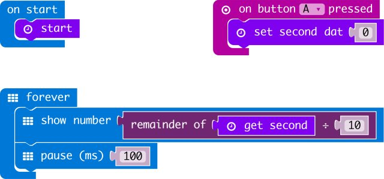

# DS1307

makecode DS1307 RTC extension for micro:bit.  

Author: shaoziyang  
Date:   2018.Mar  
  
  


## Add extension

open your microbit makecode project, in Add extension, paste  

https://github.com/makecode-packages/DS1307  

to search box then search.


## Basic usage
```
input.onButtonPressed(Button.A, () => {
    DS1307.setSecond(0)
})
DS1307.start()
basic.forever(() => {
    basic.showNumber(DS1307.getSecond() % 10)
    basic.pause(100)
})
```

## I2C Address  

- 0x68  

## API

- **function DateTime(year: number, month: number, day: number, weekday: number, hour: number, minute: number, second: number)**  
set Date and Time.  

- **function setSecond(dat: number)**  
set second.

- **function getSecond(dat: number)**  
get second.

- **function setMinute(dat: number)**  
set minute.

- **function getMinute(dat: number)**  
get minute.

- **function setHour(dat: number)**  
set hour.

- **function getHour(dat: number)**  
get hour.

- **function setWeekday(dat: number)**  
set week day.

- **function getWeekday(dat: number)**  
get week day.

- **function setDay(dat: number)**  
set day.

- **function getDay(dat: number)**  
get day.

- **function setMonth(dat: number)**  
set month.

- **function getMonth(dat: number)**  
get month.

- **function setYear(dat: number)**  
set year.

- **function getYear(dat: number)**  
get year.


## Demo



## License

MIT

Copyright (c) 2018, microbit/micropython Chinese community  

## Supported targets

* for PXT/microbit


[From microbit/micropython Chinese community](http://www.micropython.org.cn)
